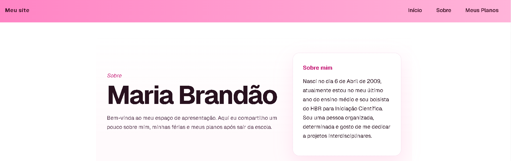

# Primeira Página Next

---

## Sobre o Projeto
Este foi o meu primeiro projeto desenvolvido com Next.js, criado com o objetivo de praticar conceitos iniciais de desenvolvimento web moderno utilizando rotas, componentes reutilizáveis e organização de páginas.

O site foi pensado como uma apresentação pessoal, contendo páginas que falam sobre mim, meus planos para o futuro e minhas férias, proporcionando uma navegação simples, organizada e agradável.

Além disso, o projeto utiliza elementos como NavBar e Rodapé, tornando a interface mais profissional e melhorando a experiência do usuário durante a navegação.

---
## Tecnologias Utilizadas

  
  
  

  

  

---

## Funcionalidades

Navegação entre páginas utilizando rotas do Next.js  
Componentes reutilizáveis  
Navbar personalizada  
Rodapé estilizado  
Páginas sobre mim, meus planos e minhas férias  
Layout simples e organizado  

---

## Objetivo do Projeto

O principal objetivo deste projeto foi aprender os conceitos iniciais do **Next.js**, incluindo:

- Criação de rotas
- Componentização
- Estruturação de layouts
- Estilização de páginas
- Organização de arquivos

Estudante de Desenvolvimento de Sistemas pelo SENAI Sorocaba, cursando o 3º semestre e iniciando sua trajetória no desenvolvimento Full Stack.

---

## Futuras Melhorias

- Responsividade para dispositivos móveis  
- Melhorias visuais  
- Animações  
- Modo escuro  
- Deploy online  

---

# Desenvolvido por
**Maria Eduarda Brandão**

Estudante de Desenvolvimento de Sistemas pelo SENAI Sorocaba, cursando o 3º semestre e atualmente iniciando sua trajetória no desenvolvimento Full Stack.

---
